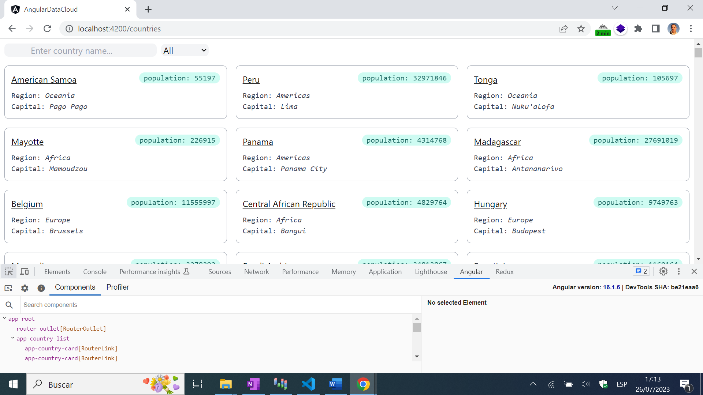
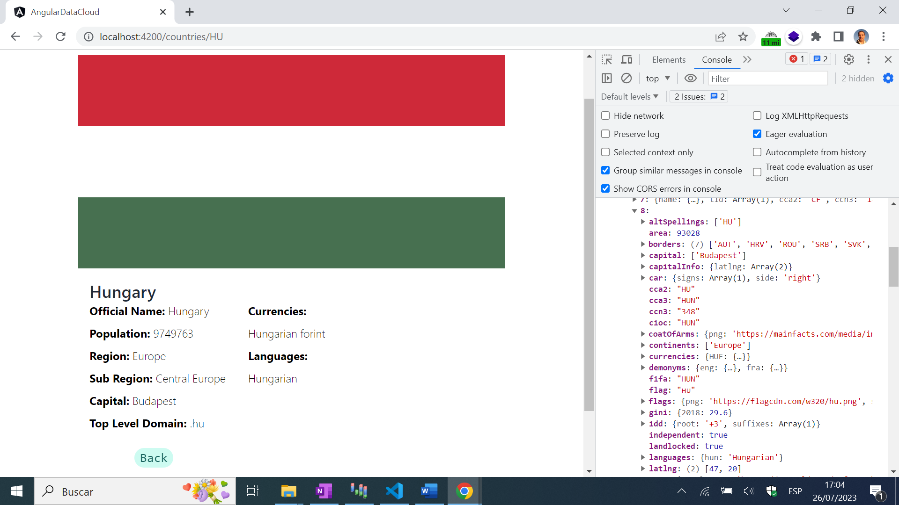

# :zap: Angular Data Signals

* Angular app to display API data using Angular signals and standalone components.
* **Note:** to open web links in a new window use: _ctrl+click on link_


## :page_facing_up: Table of contents

* [:zap: Angular Data Signals](#zap-angular-data-signals)
  * [:page\_facing\_up: Table of contents](#page_facing_up-table-of-contents)
  * [:books: General info](#books-general-info)
  * [:camera: Screenshots](#camera-screenshots)
  * [:signal\_strength: Technologies](#signal_strength-technologies)
  * [:floppy\_disk: Setup](#floppy_disk-setup)
  * [:wrench: Testing](#wrench-testing)
  * [:computer: Code Examples](#computer-code-examples)
  * [:cool: Features](#cool-features)
  * [:clipboard: Status, Testing \& To-Do List](#clipboard-status-testing--to-do-list)
  * [:clap: Inspiration/General Tools](#clap-inspirationgeneral-tools)
  * [:file\_folder: License](#file_folder-license)
  * [:envelope: Contact](#envelope-contact)

## :books: General info

* Tailwind-styled card grid used to display data from a country information API.
* Clicking on a card displays a single large card with country flag and more details such as currencies (displayed using Angular keyvalue pipe) etc.
* Objective was to use the latest Angular Signals and standalone components.

## :camera: Screenshots




## :signal_strength: Technologies

* [Angular framework v16](https://angular.io/)
* [Tailwindcss v3](https://tailwindcss.com/) CSS framework
* [SCSS/SASS](https://sass-lang.com/) CSS extension language
* [REST Countries API v3.1](https://restcountries.com/) used for data - no API key required

## :floppy_disk: Setup

* Install dependencies using `npm i`
* Run `ng serve` for a dev server. Frontend will open at `http://localhost:4200/` - refreshes on code changes
* Run `npm run build` to generate a build file

## :wrench: Testing

* No testing files used this time. Just testing by running the app.

## :computer: Code Examples

* `pages/country-list.component.ts` function to filter country list by client search text and region choice - ternery expression used for region filtering first then filter to see if any country name includes client text

```typescript
countriesFiltered = computed(() => {
    const listToFilter =
      this.regionSelected() === 'All'
        ? this.countryListData()
        : this.countryListData().filter(
            (cntry: CountryDetailInterface) =>
              cntry.region === this.regionSelected()
          );
    return listToFilter.filter((cntry: CountryDetailInterface) =>
      cntry.name.common.toLowerCase().includes(this.searchText().toLowerCase())
    );
  });
```

## :cool: Features

* Angular signals used for more efficient change detection
* Standalone components used to reduce boiler plate and do away with modules
* Tailwind styling means small styles build bundle size (2.15 kb transfer size when I generated build), depending on compression, browser parsing etc.

## :clipboard: Status, Testing & To-Do List

* Status: Working
* Testing: n/a
* To-Do: Could add a Tailwind nav bar or change API data source.

## :clap: Inspiration/General Tools

* [Install Tailwind CSS with Angular](https://tailwindcss.com/docs/guides/angular)

## :file_folder: License

* This project is licensed under the terms of the MIT license.

## :envelope: Contact

* Repo created by [ABateman](https://github.com/AndrewJBateman), email: `gomezbateman@gmail.com`
